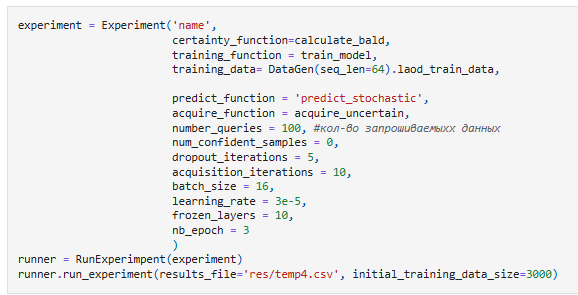
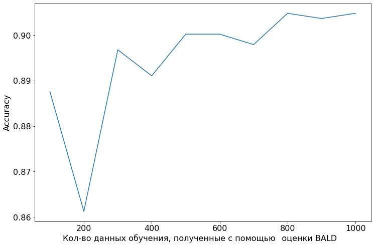

# Fine-tuning BERT via Active Learning (SST-2 Classification)

Репозиторий содержит программную среду для исследования и проведения экспериментов по тонкой настройке (Fine-tuning) языковой модели **BERT+CNN** методами **Активного обучения (Active Learning)**.

---

## 🎯 Суть работы

Проект направлен на минимизацию объема разметки текстовых данных при решении задачи бинарной классификации текста. Вместо случайного выбора сэмплов, алгоритм итеративно отбирает наиболее информативные («сложные» для модели) данные из неразмеченного пула на основе байесовской оценки неопределенности.

* **Набор данных:** Исследование проведено на датасете **SST-2 (Stanford Sentiment Treebank)** из бенчмарка GLUE. Максимальная длина последовательности — 64 токена.
* **Основная стратегия отбора:** Функция сбора данных **BALD** (Bayesian Active Learning by Disagreement) с использованием стохастических повторных прогнозов.

---

## 🛠 Возможности интерфейса

Разработан удобный интерфейс для проведения экспериментов (поддерживает Google Colab на CPU/GPU), где можно гибко настраивать:
* Размер стартовой выборки для горячего старта.
* Количество замороженных слоев модели BERT.
* Гиперпараметры обучения (`learning_rate`, `batch_size`, эпохи).
* Параметры AL (количество итераций, размер порции запроса k, число прогнозов n.

---

## 📊 Результаты экспериментов

Эксперименты проводились при фиксированном обучении в течение 3 эпох на подвыборках из 5000 случайных точек для оптимизации временных затрат.

### Эффективность стратегий Active Learning

* На графике представлена динамика обучения: последовательное добавление всего **1000 новых точек** (порциями по **100** на каждой итерации) позволяет модели набрать максимальное качество и достичь конкурентной точности в **91%**.
* Полученные результаты подтверждают эффективность функции сбора данных BALD — целенаправленный отбор наиболее информативных сэмплов обеспечивает рост метрик и экономию ресурсов разметки по сравнению со случайным сэплированием.